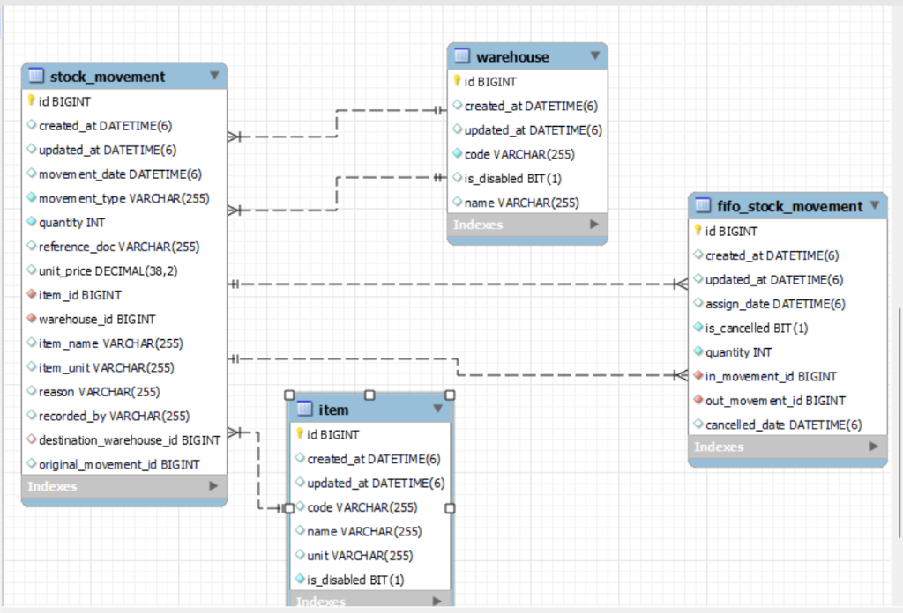

# Stock Management System - Design Document

## 1. Show us your tables. What is stored, and what is worked out when somebody asks?

**Stored:** I created tables for `item`, `warehouse`, and `stock_movement` (to store IN, OUT, TRANSFER events). I also added `fifo_stock_movement` to strictly link which IN batch was used for which OUT issue.
**Worked Out:** Current stock and total value are not saved in the database. They are calculated dynamically when requested by checking the remaining stock in the IN movements.

## 2. How do you work out the stock on a past date, and what it was worth on that date?
The code fetches all IN movements up to that past date. Then it checks the `fifo_stock_movement` table. If any stock was taken out *after* that past date, the code ignores that sale and pretends the stock is still in the warehouse. Then it calculates the remaining quantity and its original price.

## 3. Walk us through the 150-unit example. Which rows exist afterwards?
1. **1 Mar:** Row created in `stock_movement` (IN, Qty 100, Price 10).
2. **5 Mar:** Row created in `stock_movement` (IN, Qty 100, Price 12).
3. **8 Mar:** Row created in `stock_movement` (OUT, Qty 150). Automatically, two rows are added in `fifo_stock_movement`: one taking 100 units from the 1 Mar batch, and another taking 50 units from the 5 Mar batch.

## 4. Somebody cancels that issue. What happens? Which rows change/are added?
The original OUT row is not deleted. Instead, a new `stock_movement` row (CANCEL_OUT) is added. The old `fifo_stock_movement` rows are marked as `is_cancelled = true`. This puts 100 units back in the first batch and 50 units in the second batch automatically.

## 5. How do you stop two people taking the same last unit?
I used **Pessimistic Write Locking** (`@Lock(LockModeType.PESSIMISTIC_WRITE)`) in the database. 
* **The exact thing:** It forces the database to put the second person in a waiting queue until the first person's transaction is finished.
* **The cost:** If many people try to buy the exact same item at the same second, the system will become a bit slow because they have to wait in line.

## 6. A document with five lines, and line 3 fails. Explain how nothing is left behind.
I used Spring's `@Transactional` annotation. If line 3 throws an error (like insufficient stock), the whole transaction fails and rolls back. The database safely undoes the first two lines automatically.

## 7. Backdated arrivals — what did you decide, and what does your choice get wrong?
I decided that if a past arrival is entered late, we will not rewrite history. It will just be used for future issues. What this gets wrong is that past financial reports won't get updated with this potentially cheaper stock, but this keeps the accounting safe.

## 8. What breaks if there are 10 million movements instead of 10 thousand?
Even with database indexing, calculating the current stock by adding up 10 million rows on the fly will become very slow. To fix this, we will need to brainstorm a senior-level design, like keeping a daily snapshot table of the stock.

## 9. What is not finished, what is still wrong, and what would you change?
**Not finished:** Stock count and reservations are not finished. Also, due to time limits, I couldn't implement the edge case of canceling a TRANSFER properly, but I did my absolute best on the core logic. 
**What I would change:** Before real warehouses use this, I would love to design it with proper Authentication and Authorization with the help and guidance of senior engineers.
