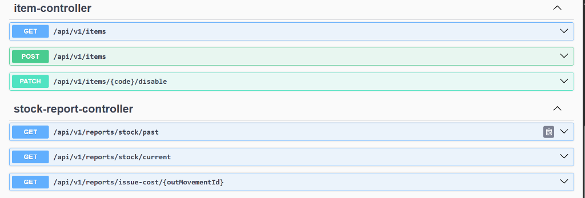
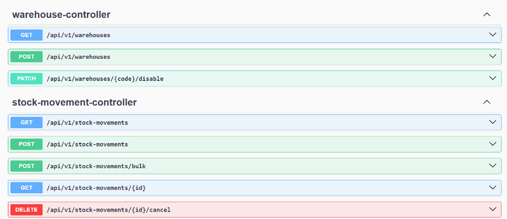

# Stock Management System (FIFO Ledger)


A robust, ledger-based Stock Management System built with Spring Boot. This system is designed to handle strict FIFO (First-In-First-Out) costing, historical stock valuation (time-travel), and high-concurrency environments without data corruption.

## Core Features

- **Append-Only Ledger Architecture:** Stock is never updated or deleted. Every operation (IN, OUT, TRANSFER, CANCEL) is recorded as an immutable movement, ensuring strict auditability.
- **Perfect FIFO Costing:** The system explicitly links every single unit that leaves the warehouse (OUT) to the exact arrival batch (IN) it came from, preserving accurate unit prices.
- **Concurrency Control (The Last Unit Problem):** Implemented Database-level **Pessimistic Write Locking** (`@Lock(LockModeType.PESSIMISTIC_WRITE)`). This guarantees that if two users request the last available unit at the exact same millisecond, they are serialized. One succeeds, and the other receives an "Insufficient Stock" error.
- **Time Travel Reporting:** Calculates exact stock availability and financial valuation for any given date in the past by reconstructing the timeline mathematically.
- **Bulk & Atomic Operations:** Bulk movement uploads are wrapped in Spring `@Transactional`. If one row in a bulk document fails, the entire transaction rolls back cleanly.

## Tech Stack
- **Java 17**
- **Spring Boot 3.x**
- **Spring Data JPA / Hibernate**
- **MySQL 8**
- **MapStruct**
- **JUnit 5 (Integration Testing)**

## Setup & Running the Application

1. **Database Setup:**
   The application is configured to connect to a local MySQL instance with the username `root` and password `root`. 
   The database name is `stock_ledger_db`. 
   (Note: `createDatabaseIfNotExist=true` is enabled, so Spring Boot will automatically create it if it doesn't exist).

2. **Run the Server:**
   Using Maven wrapper:
   ```bash
   mvn clean install
   mvn spring-boot:run
   ```
   The application is configured to start on port **9908** (accessible at `http://localhost:9908`).

3. **API Documentation (Swagger):**
   Once the server is running, you can interact with all APIs directly via the Swagger UI:
   `http://localhost:9908/swagger-ui/index.html`

## Running Tests
The project includes automated integration tests that run against the real database to verify Concurrency, Rollbacks, and FIFO cost calculations.
```bash
mvn test
```

## Key API Endpoints

### 1. Stock Movements (Bulk)
**POST** `/api/v1/stock-movements/bulk`
Record multiple IN, OUT, or TRANSFER movements atomically.
```json
[
  {
    "itemId": 1,
    "warehouseId": 1,
    "movementType": "IN",
    "quantity": 100,
    "unitPrice": 10.00,
    "recordedBy": "Admin",
    "reason": "Supplier Arrival"
  }
]
```

### 2. Current Stock & Valuation
**GET** `/api/v1/reports/stock/current?itemId=1&warehouseId=1`
Returns the exact current stock and total financial value based on unexhausted IN movements.

### 3. Past Date Stock (Time-Travel)
**GET** `/api/v1/reports/stock/past?itemId=1&warehouseId=1&asOfDate=2026-09-20T13:17:00`
Reconstructs the stock state exactly as it was at the requested date and time.

### 4. Issue Cost (FIFO Breakdown)
**GET** `/api/v1/reports/issue-cost/{outMovementId}`
Returns the exact financial cost of an OUT movement, breaking down exactly which IN batches the units were consumed from and their respective prices.

### 5. Cancel a Movement
**DELETE** `/api/v1/stock-movements/{id}/cancel`
Reverses a movement (e.g., returning OUT stock back to the exact original IN batches) by creating a reversing ledger entry.


## API Swagger Documentation

You can explore local and test all APIs interactively via the Swagger UI at: [http://localhost:9908/swagger-ui/index.html#/](http://localhost:9908/swagger-ui/index.html#/)





